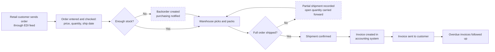
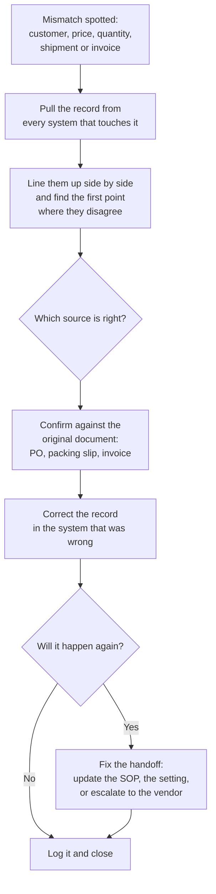
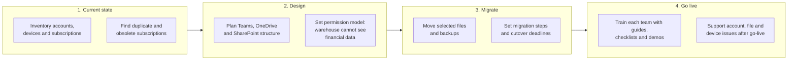

# Process Maps

Three processes from my work as Business Systems & Operations Manager at a wholesale distributor, drawn so someone new could follow them on day one. Customer names, volumes and pricing are left out.

| Map | What it shows |
|---|---|
| [1. Order to invoice](#1-order-to-invoice) | How a retail customer's order moves from the electronic order feed to a sent invoice |
| [2. Cross-system reconciliation](#2-cross-system-reconciliation) | How I find and fix records that disagree across five systems |
| [3. Microsoft 365 rollout](#3-microsoft-365-rollout) | A 3-4 month company-wide rollout, from current-state review to go-live support |

---

## 1. Order to invoice

Orders arrive through the customer EDI feed, are checked against stock, shipped (sometimes in several parts), and invoiced. The dotted boxes are where most problems started.

**Where it went wrong, and why it mattered**
- **Partial shipments.** One order could ship in three to five parts. If any part was recorded in one system but not another, the open quantity was wrong everywhere downstream.
- **Backorders across two inventory environments** that had never been synchronized, so neither one could be trusted on its own.

---

## 2. Cross-system reconciliation

Five sources had to agree on the same order: the customer EDI feed, two inventory environments, the accounting ledger, the online store, and the warehouse's own records. This is the routine I used when they didn't.

**The rule behind it:** fixing the record is half the job. The other half is changing the step that let it go wrong, so the same order doesn't need rebuilding next month.

---

## 3. Microsoft 365 rollout

A 3-4 month rollout for the whole company: 100+ account and credential entries reviewed, 10+ legacy computers, and scattered cloud resources.

**What it delivered**
- One place for company files and accounts, with a permission model that kept financial data away from warehouse staff.
- Duplicate subscriptions and obsolete payment arrangements retired along the way.
- Every team trained with guides, checklists, screenshots and demonstrations, then supported after go-live until they could work in the new environment on their own.
